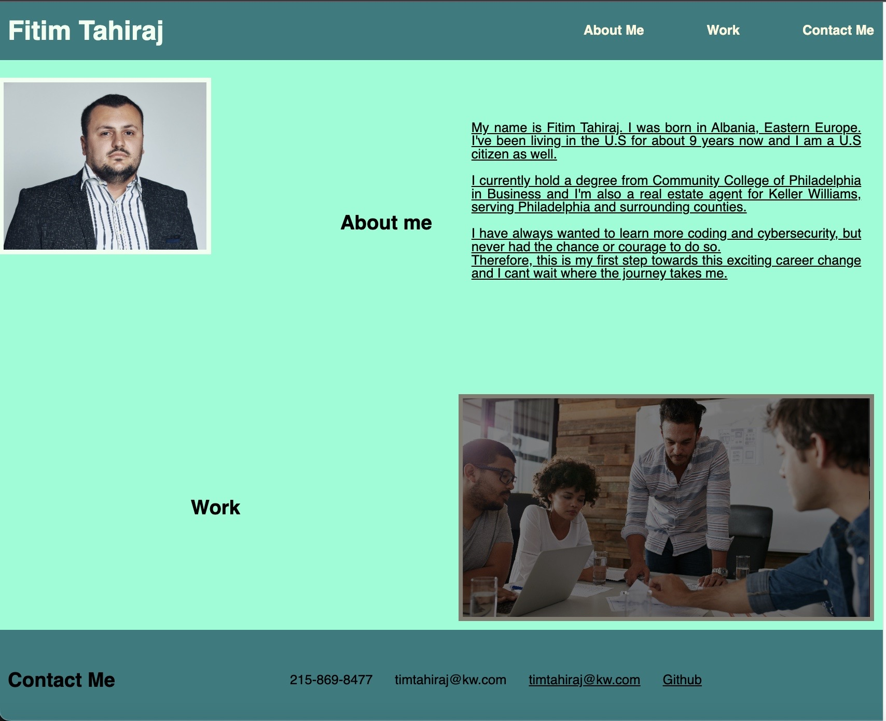

# Portfolio

## Description
Welcome to my Portfolio page, where you can get to know more about me and all my projects. This is not the final layout of the page, since during my bootcamp I will keep updating it and put more projects.  

## Installation
First create a new repository in Github by going to Settings->Repositories->New->Choose a name, make it public and choose a license.
Next, copy this repository to your local computer by opening the github and copying your repository link and then going to terminal and making sure you're at the desired folder to add it. At the terminal use these commands: git status->git clone "repository link".
Next go to my github and download the zip folder and by using GUI or your cursor you can add them in the folder you created.

## Usage
You can use this project by going to my Github account and clicking on my project repository and runnning the deployed page. 
This is how my page looks on Ipad and Desktop : 

This is how my page looks in an Iphone and mobile devices: 
Click here for deployed page: 

## Credits
Click here for Github page: <a href="https://github.com/coding-boot-camp/urban-octo-telegram.git/">urban-octo-telegram</a>

## License
MIT license